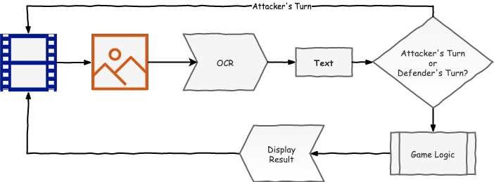

## About


This leverages OpenCV with a [CRNN model](https://github.com/qjadud1994/CRNN-Keras#crnn) to perform
Chinese character OCR and identify pieces in the strategy game
[Lu Zhan Qi (陸戰棋)](https://www.ymimports.com/pages/how-to-play-luzhanqi). Since a core component
of this game is dealing with
[imperfect information](https://policonomics.com/lp-information-economics1-perfect-imperfect-information/),
this system allows War Chess to be played with only two players by acting as an unbiased referee.

All processing is done locally.

## Setup

```
make start
```

I decided not to build this in a Dockerfile, since it's a pain to connect your webcam to the
docker container. As a result, this may vary between different OSes. For example, I was [unable
to get this running on Windows machines](https://answers.opencv.org/question/222848/help-for-videoio-error/?answer=222854#post-id-222854) but it has been tested on MacOS.

### Instructions

- Press `Space` when the tile is in the designated bounding box.
  The box will turn green when the value is successfully captured.

- Press `ESC` to quit.

## Technical Details



1. The user manually tells the computer when to take a screenshot, to convert the video
   into an image.

2. The image is then sent through the OCR engine (powered by a pre-trained CRNN model) to obtain
   the corresponding Chinese text.

3. Players take turns to scan their pieces sequentially. When the computer has seen both pieces,
   it indicates the outcome of the battle via the status line at the top left of the screen.

Check out https://aaronloo.com/weekend-project/chinese-ocr for more details.

## FAQ

### `Abort trap: 6` on OSX

Try running it on a terminal app, rather than VSCode inbuilt terminal.
Check out https://github.com/opencv/opencv/issues/12763#issuecomment-427990477 for more details.
